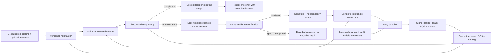

# Entry-first explanation architecture

Status: approved final target for one coordinated content-pack, API, server,
and client delivery. The existing schema-v1 pack and singular `/v2` response
remain compatibility rails for old builds only; they do not define the new
content standard.

Implementation checkpoint (2026-08-24): the schema-2 client reader/cache,
strict Swift/Go `/v3` contract, durable bounded server worker, deterministic
content builder, cross-language fixtures, inventory/disposition/trusted-
evidence preparation, signed-release packager, signature-verifying installer,
release audit tooling, and two truthful lesson-provenance paths exist in the
current working trees. Ordinary lessons retain their independent model-review
chain. A small registry of explicitly approved product goldens can bypass model
generation only when its canonical artifact, source snapshot, complete source
dispositions, public source template, human reviewer, and sign-off all match a
repository-pinned trust root; production Entry/Usage identities are then
derived again rather than copied from the conformance fixture. The installed
7-Entry/13-Usage SQLite file is only a golden conformance pack. Approved
teaching briefs and lessons for the full target inventory, a provisioned
production signing key, a signed published production pack, a populated
PostgreSQL catalog, and a deployed `/v3` service do not yet exist. Nothing in
this document should be read as claiming those release inputs are complete.
Normalization v1 is now generated from checksum-pinned official Unicode 15.1
data for Swift, Python, and Go. Shared fixtures cover non-ASCII and resolver
boundaries, CI regenerates every artifact into temporary trees and byte-compares
them, and the 149,400-spelling audit reports zero historical key/ID changes.
Identity and resolver-shape paths do not use host Unicode normalization or
category APIs. The first release can use revision `1`, but subsequent pack
publication also still needs a predecessor-aware allocator for Entry, coverage,
and lesson content revisions; current build tools initialize all three at `1`.

The current lexical-index audit provides a concrete release boundary:

- 149,400 canonical exact spellings are recorded in the current lexical index
  as candidates for server-side evidence preparation;
- 16,577 canonical spellings are selected by the existing
  COCA/BASIC/TOEFL/SAT/GRE study lists;
- 22,115 additional exact surfaces are inflected or otherwise encountered
  forms of those study targets;
- those 38,692 source surfaces normalize to 38,683 Entry keys because nine
  capitalization pairs collide under the app's case-folded lookup contract;
  one Entry at each collision must retain all distinct common usages;
- the pinned evidence/disposition audit admits 33,195 surfaces as 33,186
  evidence-backed teaching Entries and explicitly disposes the remaining 5,497
  alias-only Entries as unsupported rather than generating ungrounded lessons;
- the first complete offline teaching pack therefore targets those 33,186
  admitted Entries while deterministically accounting for all 38,692 source
  surfaces, and the full 149,400-spelling inventory stays server-side for
  verified cold misses.

This is a workload boundary, not a different lookup rule. All 38,683 audited
lookup keys are accounted for, but only the 33,186 evidence-backed records are
lesson-generation targets in the first pack. Those teaching records and every
later server result remain exact-spelling Entries. A reviewed cold result is
written to the client overlay and is folded into a subsequent
pack release, so practical offline coverage grows without making the initial
bundle carry lessons for every extremely unlikely spelling.

## Product invariant

Wordbook is not trying to reproduce a dictionary. Its job is to help a learner
understand the spelling they encountered and use it naturally.

The runtime model is therefore deliberately simple:

`exact normalized spelling -> one WordEntry -> all useful UsageLessons`

For example, the `saw` entry directly contains both the common past use of
`see` and the cutting tool. The learner does not choose a lemma, lexeme, or
dictionary sense before seeing an explanation. The app does not resolve one
either.

Every established usage selected for the product is a complete teaching unit:

- a direct, human explanation;
- one natural sentence using the encountered spelling;
- optional precise synonyms;
- at most one factual memory cue, shown last;
- learner-facing pronunciation, part-of-speech, or form-relation metadata when
  it is genuinely useful.

One to four core usages appear initially. If an entry has additional reviewed
usages, they are already part of the same local `WordEntry` and can be revealed
locally. `hasMoreUsages` means “more of this complete local entry is hidden by
the initial presentation,” not “the app has only part of the word.” Context may
reorder usages, but it must not delete them.

Rare, obsolete, and highly specialist uses are omitted when they do not help
the intended learner. “All usages” below means every pedagogically useful,
reviewed usage selected by the release policy, not every historical citation a
large dictionary has ever recorded.

## Why there are IDs but no Word Identity Map

The client still needs database keys, but these are product record identities,
not linguistic identities. The first two are opaque registry IDs; the last is
content-addressed but still carries no linguistic meaning:

- `entryID` is an opaque stable row ID for one exact-spelling entry;
- `entryUsageID` identifies one teaching usage owned by that entry;
- `explanationID` identifies one immutable version of its lesson prose.

None is shown to the learner, and the app never parses an ID to infer meaning.
They exist so feedback, replacement, caching, updates, and redirects can name
the exact record even when prose changes. `entryID` is comparable to an
ordinary database primary key; it is not a hidden layer between the spelling
and its explanation.

The exact spelling is still the lookup key. A normalized form maps directly to
one entry. The IDs only make the resulting records durable.

## Design decisions

1. **SQLite remains the local public-content store.** It is compact, indexed,
   deterministic, easy to inspect, and well suited to a signed read-only
   artifact. SQLite is not a reason to simplify the teaching content or add a
   runtime linguistic graph.
2. **Core Data/CloudKit remains personal.** Cards, schedules, answer history,
   and private source context stay there. Public explanations do not.
3. **The encountered spelling is the runtime key.** `went`, `children`, and
   `gynecologists` each have their own complete entry. The app does not stem
   them to `go`, `child`, or `gynecologist` before display.
4. **Ambiguous spellings remain one entry.** Noun, verb, inflectional, and
   pronunciation differences appear as separate `UsageLesson` values inside
   the one exact-spelling entry.
5. **Build tools may use rich linguistic evidence.** Lemmas, source senses,
   morphology, corpora, and licenses help the server decide what belongs in an
   entry. They are compile-time inputs, not the shipped data model.
6. **A complete local hit performs no explanation-network request and no model
   inference.** It is a bounded SQLite read plus lightweight ordering. Optional
   Wikipedia or discovery content may still load independently below it.
7. **Routine explanation generation does not run on the phone.** The local
   language model is reserved for future comprehension assessment. A rare
   unknown entry goes to the server, where verification, generation, and
   independent review can use stronger models and evidence.
8. **Unknown strings are not definitions waiting to happen.** A probable typo
   receives corrections. A valid rare term must pass server evidence checks
   before prose is generated.
9. **Existing good content is never blocked by refresh.** Feedback, updates,
   and replacement jobs leave the currently selected explanation visible.
10. **Every visible lesson obeys one contract.** Bundled and server-returned
    content use the same structure, quality rules, versioning, and immutable
    hash identity.

## End-to-end flow



The source graph is consumed by the compiler and stops there. Neither the
normal client lookup nor the public API asks the learner's device to navigate
that graph.

## Client release read model

The signed pack stores materialized learner-ready entries. Exact column
encoding may be optimized, but the relationships and boundary are fixed.

```sql
CREATE TABLE word_entry(
    entry_id TEXT PRIMARY KEY,
    language_tag TEXT NOT NULL,
    normalized_form TEXT NOT NULL,
    display_form TEXT NOT NULL,
    normalization_version INTEGER NOT NULL,
    entry_revision INTEGER NOT NULL CHECK (entry_revision > 0),
    entry_rank INTEGER NOT NULL,
    UNIQUE (language_tag, normalized_form, normalization_version),
    UNIQUE (entry_id, language_tag, normalized_form)
);

CREATE TABLE entry_usage(
    entry_usage_id TEXT PRIMARY KEY,
    entry_id TEXT NOT NULL,
    language_tag TEXT NOT NULL,
    normalized_form TEXT NOT NULL,
    part_of_speech_label TEXT,
    learner_label TEXT,
    pronunciation_json TEXT NOT NULL,
    form_relation_label TEXT,
    context_vector_format_version INTEGER,
    context_vector BLOB,
    display_order INTEGER NOT NULL CHECK (display_order >= 0),
    commonness_rank INTEGER NOT NULL,
    is_core INTEGER NOT NULL CHECK (is_core IN (0, 1)),
    FOREIGN KEY (entry_id, language_tag, normalized_form)
        REFERENCES word_entry(entry_id, language_tag, normalized_form),
    UNIQUE (entry_id, entry_usage_id),
    UNIQUE (entry_id, display_order),
    CHECK (
        (context_vector_format_version IS NULL AND context_vector IS NULL)
        OR
        (context_vector_format_version > 0 AND context_vector IS NOT NULL)
    )
);

CREATE TABLE released_lesson_variant(
    explanation_id TEXT PRIMARY KEY,
    entry_id TEXT NOT NULL,
    entry_usage_id TEXT NOT NULL,
    locale TEXT NOT NULL,
    schema_version INTEGER NOT NULL,
    lesson_contract_version INTEGER NOT NULL,
    validator_version INTEGER NOT NULL,
    review_policy_version INTEGER NOT NULL,
    content_revision INTEGER NOT NULL CHECK (content_revision > 0),
    content_hash TEXT NOT NULL,
    direct_explanation TEXT NOT NULL,
    example TEXT NOT NULL,
    synonyms_json TEXT NOT NULL,
    memory_cue_json TEXT,
    trust_state TEXT NOT NULL CHECK (trust_state = 'releaseReviewed'),
    FOREIGN KEY (entry_id, entry_usage_id)
        REFERENCES entry_usage(entry_id, entry_usage_id),
    UNIQUE (entry_id, entry_usage_id, locale, content_revision),
    UNIQUE (explanation_id, entry_id, entry_usage_id, locale)
);

CREATE TABLE entry_default(
    entry_id TEXT NOT NULL,
    entry_usage_id TEXT NOT NULL,
    locale TEXT NOT NULL,
    explanation_id TEXT NOT NULL,
    FOREIGN KEY (entry_id, entry_usage_id)
        REFERENCES entry_usage(entry_id, entry_usage_id),
    FOREIGN KEY (explanation_id, entry_id, entry_usage_id, locale)
        REFERENCES released_lesson_variant(
            explanation_id, entry_id, entry_usage_id, locale
        ),
    PRIMARY KEY (entry_id, entry_usage_id, locale)
);

CREATE TABLE entry_coverage(
    entry_id TEXT NOT NULL,
    locale TEXT NOT NULL,
    coverage_revision INTEGER NOT NULL CHECK (coverage_revision > 0),
    expected_usage_count INTEGER NOT NULL CHECK (expected_usage_count > 0),
    expected_core_count INTEGER NOT NULL
        CHECK (expected_core_count BETWEEN 1 AND 4),
    available_usage_count INTEGER NOT NULL,
    has_more_usages INTEGER NOT NULL CHECK (has_more_usages IN (0, 1)),
    coverage_state TEXT NOT NULL
        CHECK (coverage_state = 'releaseReviewedComplete'),
    content_version TEXT NOT NULL,
    usage_selection_policy_version INTEGER NOT NULL,
    lesson_contract_version INTEGER NOT NULL,
    validator_version INTEGER NOT NULL,
    review_policy_version INTEGER NOT NULL,
    PRIMARY KEY (entry_id, locale),
    FOREIGN KEY (entry_id) REFERENCES word_entry(entry_id),
    CHECK (expected_usage_count >= expected_core_count),
    CHECK (available_usage_count = expected_usage_count),
    CHECK (
        (has_more_usages = 1 AND expected_usage_count > expected_core_count)
        OR
        (has_more_usages = 0 AND expected_usage_count = expected_core_count)
    )
);
```

The schema reserves concrete, manifest-signed disposition tables for a future
resolver contract. An old ID may be absent from the current catalog, so full
support will require verifying it against retained signed predecessor history;
every new target has a live composite foreign key:

```sql
CREATE TABLE entry_migration(
    release_sequence INTEGER NOT NULL,
    old_entry_id TEXT NOT NULL,
    old_language_tag TEXT NOT NULL,
    old_normalized_form TEXT NOT NULL,
    new_entry_id TEXT NOT NULL,
    reason_code TEXT NOT NULL,
    FOREIGN KEY (new_entry_id) REFERENCES word_entry(entry_id),
    PRIMARY KEY (release_sequence, old_entry_id),
    UNIQUE (release_sequence, old_entry_id, new_entry_id)
);

CREATE TABLE entry_usage_disposition(
    release_sequence INTEGER NOT NULL,
    old_entry_id TEXT NOT NULL,
    old_entry_usage_id TEXT NOT NULL,
    disposition TEXT NOT NULL CHECK (disposition IN ('redirected', 'retired')),
    new_entry_id TEXT,
    new_entry_usage_id TEXT,
    migration_release_sequence INTEGER,
    reason_code TEXT NOT NULL,
    FOREIGN KEY (new_entry_id, new_entry_usage_id)
        REFERENCES entry_usage(entry_id, entry_usage_id),
    FOREIGN KEY (
        migration_release_sequence, old_entry_id, new_entry_id
    ) REFERENCES entry_migration(
        release_sequence, old_entry_id, new_entry_id
    ),
    PRIMARY KEY (release_sequence, old_entry_id, old_entry_usage_id),
    CHECK (
        (disposition = 'retired'
            AND new_entry_id IS NULL
            AND new_entry_usage_id IS NULL
            AND migration_release_sequence IS NULL)
        OR
        (disposition = 'redirected'
            AND new_entry_id IS NOT NULL
            AND new_entry_usage_id IS NOT NULL
            AND (
                (new_entry_id = old_entry_id
                    AND migration_release_sequence IS NULL)
                OR
                (new_entry_id <> old_entry_id
                    AND migration_release_sequence IS NOT NULL)
            ))
    )
);

CREATE TABLE explanation_disposition(
    release_sequence INTEGER NOT NULL,
    entry_id TEXT NOT NULL,
    entry_usage_id TEXT NOT NULL,
    old_explanation_id TEXT NOT NULL,
    disposition TEXT NOT NULL CHECK (disposition IN ('replaced', 'revoked')),
    replacement_explanation_id TEXT,
    locale TEXT NOT NULL,
    reason_code TEXT NOT NULL,
    FOREIGN KEY (
        replacement_explanation_id, entry_id, entry_usage_id, locale
    ) REFERENCES released_lesson_variant(
        explanation_id, entry_id, entry_usage_id, locale
    ),
    PRIMARY KEY (release_sequence, old_explanation_id),
    CHECK (
        (disposition = 'replaced' AND replacement_explanation_id IS NOT NULL)
        OR
        (disposition = 'revoked' AND replacement_explanation_id IS NULL)
    )
);
```

The current resolver contract requires all three tables to be empty because the
Swift resolver does not apply them yet. The installer fails closed on any row;
shipping migrations requires predecessor-history validation and runtime
application together under a later compatible resolver contract. Once enabled,
the release signature covers these rows and their `releaseSequence`. A Usage
redirect stays within the same exact entry unless a separately signed
`entry_migration` explicitly moves the whole public record. IDs are never
recycled, redirect graphs must be acyclic, and activation verifies every old
identity against the immediate trusted predecessor or retained registry.
Every pack and overlay connection enables `PRAGMA foreign_keys = ON` before any
read, validation, or write transaction.

Important consequences:

- one query by `(languageTag, normalizedForm, normalizationVersion)` finds the
  entry;
- one ordered join returns every selected usage and its default lesson;
- `entryUsageID` is globally unique and owned by exactly one `entryID`;
- `partOfSpeechLabel` and `formRelationLabel` are optional display metadata,
  not links the client must follow;
- pronunciation belongs to the Usage because the same spelling can have
  different pronunciations, as with present and past `read`;
- optional `contextVector` is a fixed-length numeric vector under a closed,
  versioned format computed only from the exported learner-facing lesson. It
  contains no text, source IDs, morphology, private glosses, or evidence. It
  can score only Usage IDs already in the entry and cannot discover a new
  meaning;
- a signed pack cannot claim completion unless all `expectedUsageCount` rows
  and defaults are present and compatible;
- a review under `usageSelectionPolicyVersion` certifies the Entry's complete
  selected-Usage membership. Matching a self-declared row count alone is not a
  coverage proof.

### What is deliberately absent from the client pack

The export must not contain:

- source lexeme, lemma, or sense IDs;
- source gloss tables;
- morphology or form-analysis graphs;
- internal usage-grouping IDs;
- teaching briefs or evidence hashes;
- row-level source provenance or license evidence (required legal notices may
  still ship as static app notices);
- generator prompts, model traces, reviewer identities, or review records.

This is a hard compilation boundary, not a naming convention. A pack-export
test opens the final SQLite schema and scans table names, columns, JSON keys,
and known internal-ID prefixes for forbidden private fields.

## Server/build-only evidence model

The server and offline build workspace retain the richer information needed to
produce reliable content. Conceptually it contains:

```text
source lexeme / source sense / attested form / morphology / corpus evidence
                              |
                              v
                 reviewed usage grouping for one exact spelling
                              |
                              v
                 versioned teaching brief + license evidence
                              |
                              v
                 generated candidate + independent review
                              |
                              v
                 Entry compiler -> learner-ready WordEntry
```

These internal records answer questions such as whether `went` is an attested
past form of `go`, whether two source senses are duplicates for teaching, and
whether **gyne-** is a defensible memory cue. The compiler then materializes a
complete `went` or `gynecologists` entry. The phone never needs the intermediate
answer.

The internal store keeps immutable teaching briefs, source/license evidence,
generation metadata, rejected candidates, independent review dimensions, and
public Entry/Usage bindings. A teaching brief must define:

- the core concept and required facts;
- ordinary situations and semantic boundaries;
- common constructions;
- exact-form example constraints;
- permitted synonyms;
- typed, sourced memory evidence, or an explicit instruction to omit a cue.

Before a brief is approved, the build-only usage-selection record must account
for every trusted source sense exactly once. Each proposed learner Usage owns
one to eight `sourceSenseMembers`; each member carries only its request-local
`sourceSensePosition` and an exact `trustedGlossEcho`. A sense that should not
be taught appears instead in the top-level `omittedSourceSenses` array with the
same position and exact echo plus a specific duplicate, obsolete, rare, or
specialist reason. The selected-member and omitted-position union must cover
every input position exactly once, with no overlap or gap.

The selector writes neither canonical evidence IDs nor `sourceSenseRef`,
`usageIndex`, `requiredConcepts`, or public identities. The build tool derives
canonical concepts and stable identities deterministically from the validated
membership and its versioned integer-to-canonical-ID map. The independent
reviewer receives a private prejoined audit of the complete decision and judges
whether each learner Usage is a coherent ordinary meaning rather than a
dictionary-sense dump. A rejected or structurally invalid proposal may be
repaired through at most two further selector candidates; three failed
candidates are terminal, so generation cannot loop indefinitely. The hard
bound remains 96 source senses per Entry. An Entry above it fails before
inference instead of turning arbitrary input partitions into permanent public
Usage boundaries. All of this is private evidence accounting: the membership,
source glosses, and source-sense identities never ship to the app or public API.

The internal review chain is:

`evidence -> approved brief -> candidate -> independent review -> approved variant -> compiled public row`

No candidate can skip a link. A model's self-reported confidence is never an
approval. Rejected material remains auditable on the server but never enters a
client pack or public response.

For the golden `gynecologist` lesson, the internal brief must require at least:

```json
{
  "exactForm": "gynecologist",
  "publicEntryUsageID": "eus_97c05aedf74749aa86ef",
  "coreConcept": "a doctor specializing in the female reproductive system",
  "requiredConcepts": [
    "medical doctor or specialist",
    "female reproductive system",
    "includes the uterus and ovaries"
  ],
  "ordinarySituations": [
    "routine checkups",
    "period problems",
    "pelvic pain",
    "other reproductive-health concerns"
  ],
  "commonConstructions": [
    "see a gynecologist",
    "make an appointment with a gynecologist"
  ],
  "exampleConstraints": [
    "use the exact singular surface form",
    "show a plausible reason for an appointment"
  ],
  "memoryEvidence": {
    "technique": "wordParts",
    "parts": [
      {"text": "gyne-", "meaning": "relates to women"},
      {"text": "-logist", "meaning": "a specialist"}
    ]
  }
}
```

The readable brief is illustrative. Production evidence items are typed,
versioned, licensed records with stable internal provenance.

## Learner-content contract

Every `UsageLesson` stands on its own. Removing its synonyms and optional
memory cue must still leave a sufficient explanation and example.

- `directExplanation` is a compact teaching paragraph, usually one or two
  sentences. It starts with the concept, not “this word means” and not a repeat
  of the title.
- `example` is exactly one natural, specific sentence using the encountered
  spelling in the intended grammatical role and meaning.
- `synonyms` contains only close substitutes for that usage. It may be empty.
- `memoryCue` is absent or one factual cue. It appears after the example and
  synonyms. Structured text segments can emphasize genuine word parts without
  storing generated Markdown.
- pronunciation, POS, and a form note are quiet metadata. A label such as
  “past form of go” can orient the learner but cannot replace the explanation.

The following are rejected as successful explanations:

- dictionary notation or fragments such as `Timid; submissive.`;
- circular wording such as `A specialist in gynecology.`;
- a bare morphology note such as `See, but in the past.`;
- an example that merely contains the spelling without demonstrating the use;
- unsupported etymology, arbitrary letter tricks, or an invented memory aid;
- unfinished text, literal ellipses, repeated filler, or a cue placed before
  the meaning and example.

Completeness is checked against the approved brief, not a word-count minimum.

## Runtime contract

The public Swift model mirrors exactly what the learner can receive:

```swift
struct ResolvedWordEntry: Sendable {
    let entryID: String
    let encounteredSurfaceForm: String
    let displayForm: String
    let normalizedForm: String
    let language: String
    let locale: String
    let usages: [UsageLesson]
    let preferredEntryUsageID: String
    let orderingSource: OrderingSource
    let expectedUsageCount: Int
    let expectedCoreCount: Int
    let hasMoreUsages: Bool
    let coverageState: CoverageState
    let contentVersion: String
    let baseContentVersion: String
    let entryRevision: Int
    let coverageRevision: Int
    let usageSelectionPolicyVersion: Int
    let normalizationVersion: Int
    let resolverContractVersion: Int
}

struct UsageLesson: Sendable {
    let entryUsageID: String
    let learnerLabel: String?
    let partOfSpeechLabel: String?
    let pronunciations: [Pronunciation]
    let formRelationLabel: String?
    let contextVector: ContextRankingVector?
    let displayOrder: Int
    let commonnessRank: Int
    let isCore: Bool
    let explanationID: String
    let contentHash: String
    let schemaVersion: Int
    let lessonContractVersion: Int
    let validatorVersion: Int
    let reviewPolicyVersion: Int
    let contentRevision: Int
    let trustState: LessonTrustState
    let content: TeacherLessonContent
}

struct TeacherLessonContent: Sendable, Codable {
    let directExplanation: String
    let example: String
    let synonyms: [String]
    let memoryCue: MemoryCue?
}

struct MemoryCue: Sendable, Codable {
    let technique: MemoryTechnique
    let segments: [LessonTextSegment]
}

struct LessonTextSegment: Sendable, Codable {
    let text: String
    let emphasized: Bool
}

struct ContextRankingVector: Sendable, Codable {
    let formatVersion: Int
    let values: [Int8]
}
```

`CoverageState` has only complete success states in the new path:

- `releaseReviewedComplete` for an active signed catalog entry;
- `serverReviewedComplete` for a complete independently reviewed server entry
  stored in the overlay.

Legacy singular content may be adapted internally during cutover, but it is
never labeled complete and never becomes the successful final-path result.
Pending, correction, negative, and unavailable are resolver outcomes, not
partial `ResolvedWordEntry` values.

`preferredEntryUsageID` must identify `usages[0]`. It is explicit for transport
and accessibility but cannot contradict the array order. `expectedUsageCount`
must equal `usages.count` before a server result is installed. The UI initially
shows the first `expectedCoreCount` usages and reveals the rest locally.
For a bundled or downloaded catalog Entry, `baseContentVersion` equals its
manifest `contentVersion`; for a server Entry it names the catalog lineage used
during review, while `contentVersion` names the server snapshot itself.

Manifest v1 does not yet declare a context-vector format, length, quantization,
or scorer, so its installer requires both context-vector columns to be null and
keeps the reviewed build order. A future manifest/contract version may admit a
closed `ContextRankingVector` only after pinning those properties. Its decoder
must reject unknown versions, wrong lengths, and every non-numeric
representation; this prevents ranking metadata from becoming a backdoor for
the private evidence graph.

The rendering order is fixed:

`title -> direct explanation -> example -> optional synonyms -> optional memory cue -> feedback`

Wikipedia and the `news`, `images`, `web`, and `translate` links remain below
the Wordbook lesson. They are optional discovery tools and never supply or
replace the explanation.

## Normalization and immutable identity

Client, pack builder, and server must produce byte-identical lookup keys.
`normalizationVersion = 1`:

1. decode valid Unicode scalars and fail closed outside the generated bounded
   English input repertoire;
2. apply Unicode NFKC using pinned Unicode 15.1 data;
3. map the explicitly enumerated curly apostrophes and hyphens to their ASCII
   forms;
4. apply locale-independent Unicode full case folding using the same pinned
   data;
5. trim and collapse Unicode 15.1 whitespace to one ASCII space; and
6. reject any emitted scalar outside the generated output repertoire.

The normalization primitive is phrase-capable and preserves historical local
identity such as `A.M.` -> `a.m.`. Resolver contract 1 is a separate generated
lookup-shape validator, applied at actual request/cold-miss boundaries rather
than to lesson prose. It admits 1-4 tokens and at most 100 scalars from the
pinned Latin-letter/combining-mark/digit repertoire, plus bounded apostrophe,
hyphen, dotted-abbreviation, and slash syntax. Thus `Achilles' heel`, `'hood`,
`rock 'n' roll`, `jack-o'-lantern`, `etc.`, `a.m.`, `U.S.`, `read/write`, and
`24/7` are structurally valid; leading decimals, controls, parentheses,
repeated/unlisted punctuation, overlength input, and a fifth token fail closed.
This validator does not assert that a spelling exists; trusted lexical evidence
does that later.

Generated mapping tables and shared fixtures are authoritative. Platform
normalizers and category APIs are not used on identity/shape paths. Locale
fallback is the exact canonical product locale tag, then its language-only tag,
then the product default `en`. The locale contract deliberately supports the
same bounded ASCII grammar in Swift and Go:
`^[A-Za-z]{2,8}(?:-[A-Za-z0-9]{1,8})*$`. Canonicalization lowercases the
language and other subtags except a two-letter region, which is uppercased.
This is a strict interoperable product subset, not a claim to implement every
valid BCP-47 construction.

Public identity rules:

- an `entryID` belongs to one `(language, normalizedForm,
  normalizationVersion)` and is never reused;
- an `entryUsageID` belongs to one entry and survives prose replacement;
- `entryRevision` identifies the entire immutable learner-facing Entry
  snapshot and increases whenever any snapshot field changes, including a new
  coverage decision;
- `coverageRevision` and `usageSelectionPolicyVersion` identify the reviewed
  decision about which usages belong in the complete Entry;
- `contentRevision` increases monotonically per
  `(entryID, entryUsageID, locale)`;
- `explanationID` changes whenever immutable learner content changes;
- a signed redirect handles curation changes; IDs are not silently repurposed.

The coverage decision has one exact public projection:
`usageSelectionPolicyVersion`, `expectedUsageCount`, `expectedCoreCount`,
`hasMoreUsages`, and every ordered Usage's `entryUsageID`, `displayOrder`,
`commonnessRank`, and `isCore`. A changed immutable snapshot always advances
`entryRevision`. `coverageRevision` advances if and only if that coverage
projection changes; prose, pronunciation, or other presentation-only changes
advance only `entryRevision`. Importers reject a changed snapshot at the same
`entryRevision`, a regressing revision, or either direction of a false
coverage-revision claim.

The immutable content envelope contains exactly `schemaVersion`, `language`,
`locale`, `lessonContractVersion`, `entryID`, `normalizedForm`,
`entryUsageID`, `directExplanation`, `example`, ordered `synonyms`, and nullable
structured `memoryCue`. POS, pronunciation, trust, review, model, evidence,
timestamps, and revisions remain outside the content envelope.

`contentHash` is lowercase hexadecimal SHA-256 over RFC 8785 canonical JSON;
`explanationID` is `exp_` followed by that full hash.

On every pack import and API response, the client reconstructs this envelope
from decoded fields, applies RFC 8785 canonicalization, recomputes SHA-256, and
requires both `contentHash` and `explanationID` to match. Pack validation also
compares the result with the stored `content_hash` column. Hash validation is
therefore executable rather than a server assertion.

The conformance fixture is:

```json
{"directExplanation":"A doctor who specializes in the female reproductive system, including the uterus and ovaries. People see one for routine checkups, period problems, pelvic pain, or other reproductive-health concerns.","entryID":"ent_7c289b912dd44cd1a53b","entryUsageID":"eus_97c05aedf74749aa86ef","example":"She made an appointment with a gynecologist because her periods had become unusually painful.","language":"en","lessonContractVersion":2,"locale":"en","memoryCue":{"segments":[{"emphasized":true,"text":"gyne-"},{"emphasized":false,"text":" relates to women; "},{"emphasized":true,"text":"-logist"},{"emphasized":false,"text":" means a specialist."}],"technique":"wordParts"},"normalizedForm":"gynecologist","schemaVersion":2,"synonyms":[]}
```

Its hash is
`a98400a1f0aa133ee5285692ff11ff2d0bfd438adda9a57ac81b948d4ec95847`,
and its explanation ID is
`exp_a98400a1f0aa133ee5285692ff11ff2d0bfd438adda9a57ac81b948d4ec95847`.
Python, Go, Swift, pack export/import, public API,
overlay persistence, and rendering must reproduce it byte-for-byte.

The context-free resolver key is:

`(language, normalizedForm, localeFallback, normalizationVersion, resolverContractVersion)`

Personal sentence context is never part of global content identity.

## Exact-form resolution and context

The input is an encounter:

```json
{
  "encounteredSurfaceForm": "saw",
  "locale": "en",
  "context": {
    "text": "I saw a fox near the road.",
    "targetStart": 2,
    "targetLength": 3,
    "offsetEncoding": "utf8"
  }
}
```

Context is optional. When supplied, offsets are UTF-8 byte offsets in the
original string. The receiver validates boundaries and confirms that the
normalized target slice equals the normalized encountered surface form.
Personal source context stays with the user's card and is uploaded only when
an explicit server task materially requires the minimal sentence.

Local resolution is:

1. normalize the exact spelling;
2. choose one active catalog: newest validated downloaded full pack, otherwise
   the bundled pack;
3. query the catalog and `overlay_active_entry` independently by the same exact
   normalized key;
4. validate both candidates and choose one whole Entry snapshot under the
   revision/lineage rules—an overlay-only rare Entry needs no catalog row;
5. load all ordered Usage/default rows from the chosen snapshot in one bounded
   read;
6. apply only a compatible explicit sidecar replacement for the chosen
   Entry/Usage/base version;
7. optionally reorder only those existing usages with local context scores;
8. validate counts and contracts, then return one complete Entry.

Catalog and overlay Usage memberships are never row-merged. That would let an
old partial Entry survive inside a newer reviewed selection policy.

The client does not stem, discover a lemma, create a usage, or discard an
approved usage. Low context confidence keeps the build order.

Required routing fixtures:

- `saw` resolves to one entry with both past-seeing and cutting-tool usages;
  context changes only their order;
- `went` resolves directly to its own entry and exact-form example;
- `children` resolves directly to its own plural entry;
- `read` retains the present `/riːd/` and past `/rɛd/` usages; context ranks the
  matching usage and pronunciation while both remain available;
- `gynecologists` resolves to its own plural entry, not a client-side lookup of
  `gynecologist`.

Build tools may know how these forms are related. That knowledge never changes
the client routing rule.

## Local layers and update behavior

The client uses one active catalog and one independent writable overlay:

1. **Bundled base pack** — read-only and app-signed; the offline floor.
2. **Downloaded full release** — optional, signed, checksummed, and atomically
   activated. It replaces the bundled catalog as a whole rather than merging
   rows from two releases.
3. **Writable overlay** — independently reviewed server entries, explicit
   replacement selections, durable job/negative state, and the feedback
   outbox.

The overlay does not copy, attach, migrate, or modify the bundled database. A
new app release can replace the public pack without touching CloudKit data.

Precedence is:

1. choose one whole compatible Entry snapshot: an overlay-only Entry when no
   catalog Entry exists, otherwise the newer compatible reviewed snapshot under
   the revision rule below, otherwise the catalog Entry;
2. apply an explicit compatible user-selected replacement to one Usage of that
   chosen snapshot without changing its Usage membership;
3. use the chosen snapshot's reviewed defaults for every other Usage;
4. otherwise return no successful explanation result.

Pending jobs, negatives, and an invalid partial payload never mask valid local
content. An overlay failure cannot disable a healthy catalog. A corrupt
downloaded release falls back to the bundled pack.

The overlay stores:

- complete immutable server-reviewed Entry snapshots;
- per-Usage replacement variants and explicit selection;
- idempotent feedback events;
- durable server job IDs, generation-key hashes, bounded check counts, and
  `nextCheckAt`;
- expiring correction/negative records.

Disposition support is reserved but disabled in resolver contract 1: all three
tables must be empty. A future compatible contract will keep signed
dispositions in the active read-only catalog, validate them against retained
release identity history, and apply them to overlay IDs without copying
cross-database foreign-key claims into the writable file.

Its reviewed-entry tables mirror the public pack contract instead of storing a
single loose explanation:

```sql
CREATE TABLE overlay_entry_identity(
    entry_id TEXT PRIMARY KEY,
    language_tag TEXT NOT NULL,
    normalized_form TEXT NOT NULL,
    normalization_version INTEGER NOT NULL,
    UNIQUE (language_tag, normalized_form, normalization_version),
    UNIQUE (entry_id, language_tag, normalized_form, normalization_version)
);

CREATE TABLE overlay_usage_identity(
    entry_usage_id TEXT PRIMARY KEY,
    entry_id TEXT NOT NULL,
    FOREIGN KEY (entry_id) REFERENCES overlay_entry_identity(entry_id),
    UNIQUE (entry_id, entry_usage_id)
);

CREATE TABLE overlay_entry(
    entry_id TEXT NOT NULL,
    language_tag TEXT NOT NULL,
    normalized_form TEXT NOT NULL,
    display_form TEXT NOT NULL,
    locale TEXT NOT NULL,
    normalization_version INTEGER NOT NULL,
    resolver_contract_version INTEGER NOT NULL,
    entry_revision INTEGER NOT NULL CHECK (entry_revision > 0),
    coverage_revision INTEGER NOT NULL CHECK (coverage_revision > 0),
    usage_selection_policy_version INTEGER NOT NULL,
    expected_usage_count INTEGER NOT NULL CHECK (expected_usage_count > 0),
    expected_core_count INTEGER NOT NULL
        CHECK (expected_core_count BETWEEN 1 AND 4),
    has_more_usages INTEGER NOT NULL CHECK (has_more_usages IN (0, 1)),
    coverage_state TEXT NOT NULL
        CHECK (coverage_state = 'serverReviewedComplete'),
    base_content_version TEXT NOT NULL,
    server_content_version TEXT NOT NULL,
    install_state TEXT NOT NULL
        CHECK (install_state IN ('pending', 'validated')),
    FOREIGN KEY (
        entry_id, language_tag, normalized_form, normalization_version
    ) REFERENCES overlay_entry_identity(
        entry_id, language_tag, normalized_form, normalization_version
    ),
    PRIMARY KEY (entry_id, entry_revision, locale),
    UNIQUE (
        language_tag, normalized_form, normalization_version,
        entry_revision, locale
    ),
    UNIQUE (
        entry_id, language_tag, normalized_form, normalization_version,
        entry_revision, locale
    ),
    CHECK (expected_usage_count >= expected_core_count),
    CHECK (
        (has_more_usages = 1 AND expected_usage_count > expected_core_count)
        OR
        (has_more_usages = 0 AND expected_usage_count = expected_core_count)
    )
);

CREATE TABLE overlay_entry_usage(
    entry_id TEXT NOT NULL,
    entry_revision INTEGER NOT NULL,
    locale TEXT NOT NULL,
    entry_usage_id TEXT NOT NULL,
    learner_label TEXT,
    part_of_speech_label TEXT,
    pronunciation_json TEXT NOT NULL,
    form_relation_label TEXT,
    context_vector_format_version INTEGER,
    context_vector BLOB,
    display_order INTEGER NOT NULL CHECK (display_order >= 0),
    commonness_rank INTEGER NOT NULL,
    is_core INTEGER NOT NULL CHECK (is_core IN (0, 1)),
    FOREIGN KEY (entry_id, entry_revision, locale)
        REFERENCES overlay_entry(entry_id, entry_revision, locale),
    FOREIGN KEY (entry_id, entry_usage_id)
        REFERENCES overlay_usage_identity(entry_id, entry_usage_id),
    PRIMARY KEY (entry_id, entry_revision, locale, entry_usage_id),
    UNIQUE (entry_id, entry_revision, locale, display_order),
    CHECK (
        (context_vector_format_version IS NULL AND context_vector IS NULL)
        OR
        (context_vector_format_version > 0 AND context_vector IS NOT NULL)
    )
);

CREATE TABLE overlay_lesson_variant(
    explanation_id TEXT PRIMARY KEY,
    entry_id TEXT NOT NULL,
    entry_revision INTEGER NOT NULL,
    locale TEXT NOT NULL,
    entry_usage_id TEXT NOT NULL,
    schema_version INTEGER NOT NULL,
    lesson_contract_version INTEGER NOT NULL,
    validator_version INTEGER NOT NULL,
    review_policy_version INTEGER NOT NULL,
    content_revision INTEGER NOT NULL CHECK (content_revision > 0),
    content_hash TEXT NOT NULL,
    direct_explanation TEXT NOT NULL,
    example TEXT NOT NULL,
    synonyms_json TEXT NOT NULL,
    memory_cue_json TEXT,
    trust_state TEXT NOT NULL CHECK (trust_state = 'serverReviewed'),
    FOREIGN KEY (entry_id, entry_revision, locale, entry_usage_id)
        REFERENCES overlay_entry_usage(
            entry_id, entry_revision, locale, entry_usage_id
        ),
    UNIQUE (
        explanation_id, entry_id, entry_revision, locale, entry_usage_id
    )
);

CREATE TABLE overlay_entry_default(
    entry_id TEXT NOT NULL,
    entry_revision INTEGER NOT NULL,
    locale TEXT NOT NULL,
    entry_usage_id TEXT NOT NULL,
    explanation_id TEXT NOT NULL,
    selection_kind TEXT NOT NULL
        CHECK (selection_kind IN ('serverDefault', 'userExplicit')),
    FOREIGN KEY (entry_id, entry_revision, locale, entry_usage_id)
        REFERENCES overlay_entry_usage(
            entry_id, entry_revision, locale, entry_usage_id
        ),
    FOREIGN KEY (
        explanation_id, entry_id, entry_revision, locale, entry_usage_id
    ) REFERENCES overlay_lesson_variant(
        explanation_id, entry_id, entry_revision, locale, entry_usage_id
    ),
    PRIMARY KEY (entry_id, entry_revision, locale, entry_usage_id)
);

CREATE TABLE overlay_active_entry(
    language_tag TEXT NOT NULL,
    normalized_form TEXT NOT NULL,
    normalization_version INTEGER NOT NULL,
    locale TEXT NOT NULL,
    entry_id TEXT NOT NULL,
    entry_revision INTEGER NOT NULL,
    FOREIGN KEY (
        entry_id, language_tag, normalized_form, normalization_version,
        entry_revision, locale
    ) REFERENCES overlay_entry(
        entry_id, language_tag, normalized_form, normalization_version,
        entry_revision, locale
    ),
    PRIMARY KEY (
        language_tag, normalized_form, normalization_version, locale
    )
);

CREATE TRIGGER overlay_active_entry_requires_validated_insert
BEFORE INSERT ON overlay_active_entry
BEGIN
    SELECT CASE WHEN NOT EXISTS (
        SELECT 1 FROM overlay_entry AS candidate
        WHERE candidate.entry_id = NEW.entry_id
          AND candidate.entry_revision = NEW.entry_revision
          AND candidate.locale = NEW.locale
          AND candidate.install_state = 'validated'
    ) THEN RAISE(ABORT, 'overlay entry is not validated') END;
END;

CREATE TRIGGER overlay_active_entry_requires_validated_update
BEFORE UPDATE ON overlay_active_entry
BEGIN
    SELECT CASE WHEN NOT EXISTS (
        SELECT 1 FROM overlay_entry AS candidate
        WHERE candidate.entry_id = NEW.entry_id
          AND candidate.entry_revision = NEW.entry_revision
          AND candidate.locale = NEW.locale
          AND candidate.install_state = 'validated'
    ) THEN RAISE(ABORT, 'overlay entry is not validated') END;
END;

CREATE TABLE overlay_catalog_replacement(
    explanation_id TEXT PRIMARY KEY,
    entry_id TEXT NOT NULL,
    entry_usage_id TEXT NOT NULL,
    locale TEXT NOT NULL,
    base_entry_revision INTEGER NOT NULL,
    base_explanation_id TEXT NOT NULL,
    base_content_version TEXT NOT NULL,
    schema_version INTEGER NOT NULL,
    lesson_contract_version INTEGER NOT NULL,
    validator_version INTEGER NOT NULL,
    review_policy_version INTEGER NOT NULL,
    content_revision INTEGER NOT NULL CHECK (content_revision > 0),
    content_hash TEXT NOT NULL,
    direct_explanation TEXT NOT NULL,
    example TEXT NOT NULL,
    synonyms_json TEXT NOT NULL,
    memory_cue_json TEXT,
    trust_state TEXT NOT NULL CHECK (trust_state = 'serverReviewed'),
    selection_kind TEXT NOT NULL
        CHECK (selection_kind IN ('serverDefault', 'userExplicit')),
    UNIQUE (
        entry_id, entry_usage_id, locale, base_entry_revision,
        base_explanation_id, explanation_id
    )
);
```

`overlay_catalog_replacement` is intentionally a sidecar rather than a copy of
catalog Entry rows. SQLite cannot enforce a foreign key across the two database
files, so installation opens the active catalog read-only, verifies the exact
`entryID + entryUsageID + baseEntryRevision + baseExplanationID +
baseContentVersion` binding and content hash, and writes the sidecar in one
overlay transaction. A catalog update automatically makes a stale binding
ineligible until a signed disposition or a newly reviewed replacement resolves
it.

Complete Entry installation also uses one transaction. The Entry remains
`pending` until SQL
checks prove that Usage count equals `expectedUsageCount`, core count equals
`expectedCoreCount`, core rows occupy exactly
`displayOrder = 0..<expectedCoreCount`, later rows are non-core, every order is
contiguous, and every Usage has one compatible default. The transaction then
marks the snapshot `validated` and atomically replaces its one
`overlay_active_entry` pointer. Readers resolve only through that pointer, so
multiple stored revisions cannot all be active and a crash cannot expose a
half-installed Entry. The persistent identity tables make `entryID -> exact
normalized tuple` and `entryUsageID -> one entryID` rebinding impossible.

“Newer” is evaluated only between compatible records. If no catalog Entry
exists, the validated overlay-only Entry is selected without inventing catalog
IDs to merge against. If both exist, the overlay may outrank the catalog only
when its `usageSelectionPolicyVersion` matches, `entryRevision` is strictly
greater, `coverageRevision` is greater than or equal to the catalog value, and
`baseContentVersion` names the catalog lineage against which it was reviewed.
A coverage decision can keep its revision while other Entry content advances,
but it cannot change without a new whole-snapshot `entryRevision`. A later
signed release can incorporate or revoke
it through exact public-ID dispositions; string timestamps are never used for
precedence.

Release checks happen outside the word-lookup hot path. The signed manifest
includes immutable sequence/content version, pack and lesson contracts,
normalization/resolver/validator/review and usage-selection-policy versions,
supported locales, minimum app build, compressed and uncompressed hashes/sizes,
immutable artifact URL, creation time, rollback authorization, and signing
`keyID`.

The release/build installer currently verifies the manifest signature and
compatibility before download, then verifies compressed hash, decompressed
hash, the exact pinned SQLite DDL, integrity, foreign keys,
forbidden-internal-field scans, runtime-readable records, Entry coverage,
content hashes, and defaults before atomic activation into the next build.
It tracks both the active and highest-ever accepted sequence, requires a
separately trusted rollback key, retains the previous-good pack, and uses a
pending activation receipt to recover the pack/state rename crash window. The
anti-replay guarantee depends on retaining that ledger; release automation must
keep the state and pending-receipt paths in durable, access-controlled storage
and restore them before a later publication run. A future on-device updater
must use app-protected durable storage for the same reason. The
bundled pack remains the runtime offline floor. Runtime download of a full
signed catalog is a later transport integration, not a claim made by the
current app. The server stores and serves the exact canonical signed manifest
bytes.

## Client and server responsibility split

| Responsibility | Client | Server/build pipeline |
|---|---|---|
| Exact normalization | Execute pinned contract | Use identical contract |
| Known-word lookup | Exact spelling to complete local Entry | Not involved |
| Linguistic evidence | None in runtime contract | Own source forms, senses, morphology, corpora, and licenses |
| Usage selection | Consume reviewed Entry membership | Group, verify, and independently review |
| Context | Reorder existing Usage IDs only | Optional help for an explicit unresolved task |
| Unknown spelling | Validate shape, suggest local corrections, request server resolution | Verify valid term or return corrections/negative |
| Rare valid term | Persist only a complete reviewed response | Generate with strong model, independently review, cache, return, and queue for next pack |
| “Not helpful” | Keep current lesson; queue one idempotent request | Produce and review one coherent replacement for the same Usage |
| Helpful/not-helpful signal | Durable outbox | Idempotent aggregation and ranking signal |
| Content update | Verify and atomically activate | Compile, audit, sign, and publish |
| Future comprehension check | Prefer private on-device evaluator | Bounded fallback when local assessment is unreliable |

### Model allocation

- **Build-time generator:** a pinned high-quality English-capable Ollama model
  generates nearly all lessons from approved internal briefs.
- **Independent build reviewer:** a different pinned model/process plus
  deterministic validators must approve every required dimension. The
  generator cannot approve itself.
- **Interactive server models:** handle the rare verified miss and explicit
  replacement in durable workers. A result is not returned as successful until
  independent review passes.
- **Phone model:** does not generate routine explanations. Its planned role is
  to judge the learner's typed or transcribed explanation against a compact
  rubric. It is loaded lazily for that feature and does not gate normal app
  startup or SQLite explanation readiness.
- **Deterministic code/data:** owns normalization, exact-entry lookup, spelling
  suggestions, public IDs, bounded jobs, update security, and cache state.

The existing `lexical-index.wbli` remains useful for autocomplete, spelling
suggestions, aliases, and vocabulary-list membership. It is not an explanation
authority and does not become a second runtime explanation graph.
An alias may suggest or capture a spelling, but it cannot silently substitute
another Entry during explanation lookup. Once accepted, the normalized spelling
must have its own materialized Entry or follow an explicit signed whole-entry
migration.

Future comprehension assessment may compare the learner's answer with the
public `TeacherLessonContent`, or with a separate public assessment rubric whose
closed schema is independently exported. It must never receive, reconstruct,
or reuse the private teaching brief or source-evidence graph.

## True-miss and typo state machine

A local miss is bounded:

1. validate language, Unicode, punctuation, token count, and length;
2. confirm there is no exact complete Entry in active catalog or overlay;
3. obtain deterministic, frequency-ranked spelling suggestions;
4. send one idempotent server resolve request for the exact spelling;
5. let the server check reviewed cache and deterministic source evidence;
6. return a correction when the input is probably wrong;
7. for a valid new term, create or reuse one durable generation-and-review job;
8. return only a complete `serverReviewedComplete` Entry when that job passes;
9. otherwise persist a finite `probableTypo`, `notFound`, `unsupported`, or
   `reviewFailed` result with `retryAfter`/expiry.

There is no recursive model retry and no on-device explanation fallback. One
server job has a bounded attempt count. The client persists its `jobID`, honors
`Retry-After`, makes at most one bounded foreground status check, and can resume
at a later foreground/background opportunity. Reopening the card reuses the
same generation key rather than starting another job.

The server allocates public records only after verification:

- one stable `entryID` for the exact normalized spelling;
- one stable `entryUsageID` for each approved teaching usage inside it;
- internal mappings from those records to source evidence;
- one immutable `explanationID` for each approved content variant.

Concurrent verification is serialized by language plus normalized form. The
server never mints public identity from generated prose and never creates an
`ollama:` pseudo-sense. If evidence is insufficient, the result is negative.

## Public API v3

The singular `/v2` response cannot be silently reinterpreted. The new contract
uses:

```http
POST /v3/entries/resolve
```

```json
{
  "requestID": "019...",
  "encounteredSurfaceForm": "saw",
  "language": "en",
  "locale": "en",
  "context": {
    "text": "I saw a fox.",
    "targetStart": 2,
    "targetLength": 3,
    "offsetEncoding": "utf8"
  },
  "clientContentVersion": "...",
  "normalizationVersion": 1,
  "resolverContractVersion": 1,
  "lessonSchemaVersion": 2,
  "lessonContractVersion": 2,
  "validatorVersion": 2,
  "minimumReviewPolicyVersion": 5,
  "minimumUsageSelectionPolicyVersion": 1,
  "confirmedRareSpelling": false
}
```

`requestID` makes delivery idempotent. `confirmedRareSpelling` may suppress a
repeated correction prompt but cannot bypass server evidence verification.

Unknown-entry jobs are coalesced by an immutable key containing job kind,
language, normalized form, locale, normalization/resolver versions, evidence
snapshot hash, usage-selection policy, generation/lesson/validator/review
contracts, generator and reviewer model digests, prompt hashes, and output
schema. Replacement keys additionally contain `entryID`, `entryUsageID`,
`baseEntryRevision`, `baseContentVersion`, `baseExplanationID`, the exact
approved generation-plan hash, the exact target teaching-brief hash, and sorted
excluded explanation IDs. The server selects the plan, target brief, and
evidence snapshot atomically and persists that same immutable tuple in the job
and replacement lineage. A later approved brief over unchanged evidence cannot
silently change already queued work. The transport request ID is not the
shared-work key.

The initial policy permits at most two generated candidates, one independent
semantic decision per candidate, and 180 seconds of total worker time. A
semantic rejection can cause at most one corrected second candidate; it cannot
recurse. `reviewFailed` negatives expire after 24 hours and deterministic
`notFound`/`unsupported` negatives after seven days. These limits are pinned by
the versioned job policy and are included in compatibility tests.

The response is a discriminated union:

- `resolved` — one complete reviewed `WordEntry`;
- `correctionRequired` — ranked candidates; no prose model ran;
- `pending` — one stable server job exists;
- `negative` — terminal-for-now machine reason plus finite expiry;
- `unavailable` — transient service failure, never fake content.

There is no public teaching-brief-only, linguistic-graph-only, or
partial-success response. The public API never sends teaching briefs, lexemes,
source senses, morphology analyses, evidence records, or reviewer provenance
to the app.

Example `resolved` payload:

```json
{
  "result": "resolved",
  "entryID": "ent_5e5a8f826ba04d6698e4",
  "encounteredSurfaceForm": "saw",
  "displayForm": "saw",
  "normalizedForm": "saw",
  "language": "en",
  "locale": "en",
  "preferredEntryUsageID": "eus_8f4c39a21d7b4e1a",
  "orderingSource": "context",
  "expectedUsageCount": 2,
  "expectedCoreCount": 2,
  "hasMoreUsages": false,
  "coverageState": "serverReviewedComplete",
  "contentVersion": "server-entry-2026-08-23",
  "baseContentVersion": "content-2026-08",
  "entryRevision": 3,
  "coverageRevision": 2,
  "usageSelectionPolicyVersion": 1,
  "normalizationVersion": 1,
  "resolverContractVersion": 1,
  "usages": [
    {
      "entryUsageID": "eus_8f4c39a21d7b4e1a",
      "learnerLabel": "earlier seeing or meeting",
      "partOfSpeechLabel": "verb",
      "pronunciations": [{"ipa": "sɔ", "locale": "en-US"}],
      "formRelationLabel": "past form of see",
      "displayOrder": 0,
      "commonnessRank": 1,
      "isCore": true,
      "explanationID": "exp_4d5d8bf84dd0d81c853310dc50bb059214cb167e26e9f797bd4f8151ec7f5364",
      "contentHash": "4d5d8bf84dd0d81c853310dc50bb059214cb167e26e9f797bd4f8151ec7f5364",
      "schemaVersion": 2,
      "lessonContractVersion": 2,
      "validatorVersion": 2,
      "reviewPolicyVersion": 5,
      "contentRevision": 1,
      "trustState": "serverReviewed",
      "content": {
        "directExplanation": "Noticed or watched something, or met someone, at an earlier time. It can describe spotting a bird, watching a movie, or visiting a doctor.",
        "example": "I saw a fox cross the road on my way home.",
        "synonyms": [],
        "memoryCue": null
      }
    },
    {
      "entryUsageID": "eus_c21bd84f69a742ea",
      "learnerLabel": "cutting tool",
      "partOfSpeechLabel": "noun",
      "pronunciations": [{"ipa": "sɔ", "locale": "en-US"}],
      "formRelationLabel": null,
      "displayOrder": 1,
      "commonnessRank": 2,
      "isCore": true,
      "explanationID": "exp_68ddb79aafb8ef7a1c7fe0fd5e3b1015a4a43c7191a42561e2303ffaff861429",
      "contentHash": "68ddb79aafb8ef7a1c7fe0fd5e3b1015a4a43c7191a42561e2303ffaff861429",
      "schemaVersion": 2,
      "lessonContractVersion": 2,
      "validatorVersion": 2,
      "reviewPolicyVersion": 5,
      "contentRevision": 1,
      "trustState": "serverReviewed",
      "content": {
        "directExplanation": "A tool with a toothed blade for cutting wood or other hard materials. Some are moved by hand; others use a motor.",
        "example": "He used a saw to cut the board into two shorter pieces.",
        "synonyms": [],
        "memoryCue": null
      }
    }
  ]
}
```

The server must return the full selected Entry atomically. A payload with one
missing Usage, mismatched count, wrong Entry/Usage binding, invalid hash, or
incompatible contract installs nothing.

The example `entryID` and `entryUsageID` values deliberately carry no `saw`,
POS, or source meaning. Conformance tests replace those two registry IDs with
arbitrary valid values and require identical behavior; client code may compare
them for equality but may not parse, prefix-match, sort semantically, or branch
on their text. `explanationID` is the one exception: its prescribed `exp_` plus
SHA-256 encoding is parsed only to perform the content-hash validation above,
never to infer linguistic meaning.

Durable generation jobs are read through:

```http
GET /v3/jobs/{jobID}
```

Every response includes job kind, canonical key hash, state, and timing. A
successful rare lookup returns one complete Entry. Failure never embeds
partial prose.

Explicit replacement is separate:

```http
POST /v3/entries/{entryID}/usages/{entryUsageID}/replacements
```

It names `baseExplanationID`, the disliked component, excluded explanation
IDs, `baseEntryRevision`, `baseContentVersion`, one idempotent request ID, and
compatible contract versions. The server generates and reviews a complete
replacement lesson for the same Usage; it never patches one field in isolation
or changes the meaning.

## Feedback semantics

Explanation feedback is separate from `GOOD`, `VAGUE`, and `NOIDEA`, which
continue to measure the learner's familiarity with the word.

A feedback event contains:

- immutable `eventID`;
- `entryID`, `entryUsageID`, and `explanationID`;
- `helpful` or `notHelpful`;
- optional component (`explanation`, `example`, `memoryCue`, or `wholeLesson`);
- the exact displayed `baseEntryRevision`, `baseContentVersion`, content,
  app, and contract versions;
- whether one replacement is requested.

The versioned outbox envelope stores both the event and the complete validated
`ResolvedWordEntry` snapshot that the learner saw before delivery. Retries use
that persisted base even if a newer catalog or replacement becomes active in
the meantime; they never reconstruct the request from current content. The
same event UUID must therefore have a byte-identical full envelope, and the
server rejects reuse with different content.

`Helpful` adds a ranking signal and never starts generation. `Not helpful`
keeps the current lesson visible and may request exactly one replacement. A
replacement is accepted only when it has a new immutable explanation ID, the
same Entry/Usage binding, a complete lesson, and an independent review pass.

Feedback is not truth. It can prioritize an approved lesson for review or help
rank independently approved alternatives, but it cannot promote raw generated
content. Low-rated defaults can be replaced in the next signed release without
losing immutable history.

## Build-time generation and review

The expensive work happens before release:

1. import and validate licensed forms, meanings, morphology, corpus evidence,
   frequency, and provenance into the private build graph;
2. enumerate every target exact spelling from study lists and the release
   corpus;
3. select all pedagogically useful usages for each spelling, map every selected
   source sense to explicit required concepts, independently audit every
   selected or omitted source-sense disposition, identify one to four initial
   core usages, and allocate public Entry/Usage IDs;
4. build and independently approve a versioned teaching brief for each
   Entry/Usage pair;
5. generate a complete surface-form lesson for every Usage that does not have
   an explicitly registered human-approved product golden;
6. independently review generated lessons for correctness, required-concept
   coverage, boundaries, learner voice, non-circularity, exact-form example
   quality, and cue truth; for a registered product golden, revalidate the
   pinned human approval and exact approved lesson instead of manufacturing
   generator or model-review records;
7. compile only approved public fields into the Entry-first SQLite read model;
8. validate exact coverage, forbidden-field stripping, hashes, foreign keys,
   deterministic bytes, and shared fixtures;
9. sign and publish the release manifest and immutable artifact.

Build tools can reuse evidence or draft work between related spellings to save
compute. The final output remains materialized per exact entry, so runtime speed
and offline behavior do not depend on following those relations.

Every model-generated candidate passes three non-substitutable gates:

1. **Structure:** exact public Entry/Usage binding, compatible versions,
   non-empty explanation and example, valid structured cue, and exact-form use.
2. **Deterministic anti-patterns:** reject fragments, circular definitions,
   title-prefaces, morphology-only text, generic examples, unfinished prose,
   duplicated filler, and unsupported memory claims.
3. **Independent semantic review:** every required fact is correct and present,
   ordinary use is recognizable, boundaries are respected, the voice is direct
   and teacher-like, and the example demonstrates the Usage.

Every required dimension passes individually. An average score cannot hide a
failed fact, and the generation model cannot approve itself.

Model identity is also exact. Every build and fallback job binds the loaded
model digest, prompt digest, request-schema digest, response-schema digest, and
the complete effective inference envelope. Context/output limits, thinking,
seed, keep count, top-k, top-p, min-p, typical-p, repeat window/penalty,
presence/frequency penalties, and stop sequences are explicit; no Ollama
default is silently inherited. Prompt truncation and context shifting are
explicitly disabled, so oversized evidence fails instead of silently dropping
source senses. Fractional settings are stored as canonical decimal strings and
converted to numbers only at transport, avoiding cross-language floating-point
drift in identity hashes.

Human-approved product goldens form a separate, deliberately narrow provenance
arm. A downstream lesson runner, PostgreSQL importer, or release packager must
not trust a manifest's `humanProductGolden` label by itself. Each standalone
boundary resolves the exact spelling and selection-policy version through the
repository trust-root registry, rechecks the externally pinned approval digest
and source snapshot, binds the full approved public template and its hash, and
requires the approved Usage order, metadata, content, source-sense membership,
human identity, and review time. Unknown or self-rehashed approvals fail closed.
This preserves a useful hand-approved golden such as `saw` without pretending a
model generated or independently reviewed it.

Release validation additionally requires:

- one Entry for every release-manifest spelling;
- one or more Usage rows for every Entry;
- unique, contiguous display order;
- exactly `expectedCoreCount` core rows occupying
  `displayOrder = 0..<expectedCoreCount`, with every later row non-core;
- one default lesson for every exported Usage;
- exact agreement among expected, available, core, and `hasMoreUsages` values;
- one to four core usages and all additional selected usages present locally;
- an independent usage-selection review certifying the full membership under
  `usageSelectionPolicyVersion`, not merely its row count;
- byte-valid pronunciation and optional labels;
- approved current-contract content with recomputed hashes;
- no internal evidence table, column, identifier, or JSON key in the artifact;
- exact `saw`, `read`, `went`, `children`, `gynecologist`, and
  `gynecologists` routing fixtures.

These are build failures, not runtime warnings.

## Runtime cutover and failure semantics

- A complete local hit starts no explanation network request and no model
  inference. Wikipedia or image discovery may still use the network, but never
  blocks the explanation.
- SQLite lookup begins immediately and never waits for pronunciation,
  Wikipedia, model preparation, or another card.
- Explanation prefetch begins as soon as the next exact spelling is known.
- A server miss is coalesced, bounded, persisted, and cached after success.
- Coalesced jobs contain only caller-neutral generation material. Per-request
  surface text and context are projected only into that caller's response.
- Catalog publication and job creation share one per-Entry PostgreSQL advisory
  lock. PostgreSQL time terminalizes expired jobs even when no worker is alive.
- A slow inference renews its lease; losing that lease cancels the model call
  and prevents the stale worker from publishing.
- Public server DTOs are reconstructed from normalized relational rows. A
  completed job is immutably bound to the exact Entry/revision or replacement
  lesson it published, so opaque JSON cannot substitute content or downgrade a
  result revision.
- Invalid or partial server responses install nothing.
- A failed refresh, feedback upload, update, or context rank leaves existing
  content visible.
- A bad downloaded pack falls back to the bundled pack; a broken overlay does
  not disable the catalog.
- The local language model no longer gates startup for ordinary explanations.
  Natural-pronunciation preparation retains its separate readiness contract.
- The Share extension queues unresolved work for the phone. Watch displays a
  small phone-supplied snapshot of complete entries and never runs the language
  model.

Initial measurable targets:

- zero explanation-resolver network calls for a complete local hit;
- p95 exact-entry SQLite resolution below 50 ms on supported iPhones, excluding
  rendering;
- 100% offline explanation coverage for bundled study-list spellings;
- at least 95% complete local-hit rate across active catalog plus overlay;
- one server job per canonical unknown-entry or replacement key;
- no explanation generation for a probable typo;
- every ambiguous fixture retains all approved usages;
- every shipped default passes the current brief, contract, validator, review,
  and release checks;
- 100% of goldens pass and 100% of anti-goldens fail with stable reasons.

## Golden acceptance fixtures

These fixtures define product content and routing, not visual layout.

### `saw`

Without context, return these two complete usages in reviewed order:

```markdown
# saw — common past usage of see

Noticed or watched something, or met someone, at an earlier time. It can
describe spotting a bird, watching a movie, or visiting a doctor.

*“I saw a fox cross the road on my way home.”*
```

```markdown
# saw — cutting tool

A tool with a toothed blade for cutting wood or other hard materials. Some are
moved by hand; others use a motor.

*“He used a saw to cut the board into two shorter pieces.”*
```

`I saw a fox` ranks the first usage first. `Pass me the saw` ranks the tool
first. Both responses retain both usages.

### `gynecologist`

```markdown
# gynecologist

A doctor who specializes in the female reproductive system, including the
uterus and ovaries. People see one for routine checkups, period problems, pelvic
pain, or other reproductive-health concerns.

*“She made an appointment with a gynecologist because her periods had become
unusually painful.”*

**gyne-** relates to women; **-logist** means a specialist.
```

The paragraph is the direct explanation, the italic sentence is the example,
and the last line is the optional factual cue. The stored content is structured
canonical JSON, not generated Markdown.

### `meek`

```markdown
# meek

Quiet and gentle, but unlikely to argue or stand up for yourself—even when you
probably should.

*“He was too meek to complain when the waiter brought the wrong meal.”*

Think gentle and submissive, not simply kind.
```

### Form-routing fixtures

Usage-selection policy 1 pins these complete fixture memberships. Changing a
membership requires a new policy version and updated golden artifact; a test
cannot declare success by returning an arbitrary subset.

| Form | Selected Usage | Core/order | Pronunciation | Direct explanation | Exact-form example |
|---|---|---:|---|---|---|
| `saw` | earlier seeing, watching, or meeting | yes / 0 | `/sɔ/` | Noticed or watched something, or met someone, at an earlier time. It can describe spotting a bird, watching a movie, or visiting a doctor. | I saw a fox cross the road on my way home. |
| `saw` | cutting tool | yes / 1 | `/sɔ/` | A tool with a toothed blade for cutting wood or other hard materials. Some are moved by hand; others use a motor. | He used a saw to cut the board into two shorter pieces. |
| `went` | earlier movement, travel, or attendance | yes / 0 | `/wɛnt/` | Moved or traveled to another place, or attended somewhere, at an earlier time. | She went to the library after lunch. |
| `went` | change into a state | yes / 1 | `/wɛnt/` | Changed into a different condition or state. It is often followed by words such as *quiet*, *dark*, *wrong*, or *missing*. | The room went quiet when the teacher walked in. |
| `went` | how something progressed | yes / 2 | `/wɛnt/` | Happened or progressed in a particular way. | The interview went better than he expected. |
| `read` | present or habitual reading | yes / 0 | `/riːd/` | Look at and understand written words, either now or as a regular activity. | I read the news every morning. |
| `read` | completed earlier reading | yes / 1 | `/rɛd/` | Looked at and understood written words at an earlier time. | I read the email yesterday before the meeting. |
| `read` | something worth reading | yes / 2 | `/riːd/` | Something written that is enjoyable, useful, or otherwise worth reading. | The article is a quick read but explains the idea clearly. |
| `children` | young people | yes / 0 | `/ˈtʃɪldrən/` | Young people who have not yet become adults. | The children played in the park after school. |
| `children` | a person's sons or daughters | yes / 1 | `/ˈtʃɪldrən/` | A person's sons or daughters, including when they are grown. | Their children now live in three different cities. |
| `gynecologists` | plural medical specialists | yes / 0 | release-curated | Doctors who specialize in the female reproductive system, including the uterus and ovaries. People see them for routine checkups, period problems, pelvic pain, or other reproductive-health concerns. | The clinic's gynecologists treat a wide range of reproductive-health concerns. |

The machine fixtures give each row an opaque `entryUsageID`, full lesson
payload, core flag/order, pronunciation record, content hash, and
`explanationID`. Their manifests declare counts: `saw = 2`, `went = 3`,
`read = 3`, `children = 2`, and `gynecologists = 1`, with no additional
policy-1 usages. Every fixture asserts exactly one exact-Entry query and zero
lemma or base-form queries.

`I read every night` ranks `/riːd/` first; `I read it yesterday` ranks `/rɛd/`
first. Both results still contain all three `read` Usage rows. Likewise,
`I saw a fox` and `Pass me the saw` change only the order of the two local
`saw` rows.

- unknown word while offline: no on-device explanation generation and an
  honest unavailable/cached-negative state;
- bundled `gynecologist`: byte-exact render with zero explanation-network calls.

### Anti-golden rejection fixtures

- `A specialist in gynecology.` — circular;
- `A doctor for women.` — overly broad and inaccurate;
- `A doctor specializing in the female reproductive system.` — true but
  incomplete against the approved golden brief;
- `See, but in the past.` — form relation instead of an explanation;
- `Timid; submissive.` or `Quiet and gentle.` — dictionary fragments that omit
  the practical distinction required for `meek`;
- `The car has a large age and can move quickly.` — unnatural and semantically
  wrong for `puissance`;
- any generic example that only contains the spelling;
- any invented word origin or arbitrary letter trick;
- any cue displayed before the explanation or example.

Shared fixture files must survive build Python -> release SQLite -> Go API ->
overlay SQLite -> Swift DTO -> renderer byte-for-byte. Server/build evidence
tests separately verify morphology and source grouping; those internal records
must not appear in the client round-trip fixture.

## One final delivery plan

This is one production target, not a sequence of reduced product versions.
The ordering below describes dependencies and parallel work, not intermediate
experiences to ship.

### Hard dependency: freeze the shared public contract

Before corpus generation or runtime implementation:

1. freeze `WordEntry`, `UsageLesson`, `TeacherLessonContent`, public IDs,
   normalization, canonical JSON, hashing, trust states, and reason codes across
   Python, Go, SQLite, and Swift;
2. make `saw`, `went`, `read`, `children`, `gynecologist`, `gynecologists`, and
   anti-golden fixtures executable through every public layer;
3. freeze schema-v1, old prompts, and `/v2` as legacy rather than mutating them;
4. lock one hashed release-input manifest containing corpus lists, expected
   Entry/Usage coverage, source inventories and licenses, private evidence
   snapshot, generator/reviewer digests, prompts, schemas, inference settings,
   and signing/publication configuration;
5. add an export-boundary test proving the final SQLite and public API contain
   none of the forbidden private graph.

### Workstream A — evidence, content, and Entry compiler

- Import licensed lexical and corpus evidence into server/build-only storage.
- Enumerate all target exact spellings and select every pedagogically useful
  Usage for each.
- Allocate stable public Entry/Usage IDs and keep private evidence mappings.
- Produce and independently approve each teaching brief.
- Generate and independently review every non-golden surface-form lesson,
  retaining rejected candidates and reasons only in the private audit store;
  separately revalidate the exact human attestation for each registered
  product golden without inventing model provenance.
- Compile complete learner-ready Entry rows, defaults, counts, pronunciation,
  labels, hashes, and dispositions into deterministic SQLite.

### Workstream B — server and Ollama workers

- Add append-only PostgreSQL migrations and preserve `/v2` for old clients.
- Store the full private evidence/review graph and the compiled public Entry
  representation separately.
- Implement `/v3/entries/resolve`, durable bounded jobs, job status, explicit
  replacement, feedback ingestion, negatives/corrections, and signed release
  discovery.
- Pin strong English-capable generator and independent reviewer models by
  digest and contract. Never return raw or partially reviewed prose.
- Cache every successful rare Entry on the server and feed it into the next
  release build.

### Workstream C — client and presentation

- Add the Entry-first read-only SQLite reader and writable overlay.
- Resolve exact spellings directly; use context only to reorder existing Usage
  rows. Never stem to another entry.
- Make complete local hits immediate, zero-network, and independent of the
  phone language model.
- Coalesce/persist the rare server miss, validate the complete response, and
  cache it atomically.
- Add idempotent feedback and replacement outboxes while keeping current
  content visible.
- Render all Usage lessons in the agreed teacher order and retain Wikipedia and
  external discovery below them.
- Remove local-language-model warm-up from ordinary explanation startup; keep
  the model behind the future comprehension-assessment boundary.
- Provide Watch with a durable phone-supplied snapshot of complete entries.

### Workstream D — conformance, security, and release

- Share exact fixtures and hashes across Python, Go, SQLite, and Swift.
- Audit coverage, ambiguity, wording, examples, cues, pronunciation, duplicate
  usages, and expected counts.
- Test offline lookup, unknown words, typos, concurrent jobs, bounded retry,
  cancellation/relaunch, feedback identity, corrupt overlay, bad signatures,
  interrupted activation, rollback, and old-client compatibility.
- Test real iPhone behavior without subjective human-feedback gates; skip only
  tests that inherently require a person's quality judgment.
- Measure the stated local latency and hit-rate targets.
- Publish only when the signed pack, deployed `/v3`, compatible client, and
  rollback artifact all pass the same contract suite.

### Cutover rule

The app activates schema 2 atomically and never mixes rows from old and new
catalogs. A legacy singular explanation cannot satisfy a normal Entry-first
result. `/v2` remains only for supported old builds.

Delivery is complete only when:

- bundled `gynecologist` renders the exact golden content with zero resolver
  network or model work;
- the same reviewed Entry returned by `/v3` survives API -> overlay -> Swift ->
  renderer byte-for-byte;
- `saw` always contains two complete lessons and context changes only order;
- `went`, `read`, `children`, and plural forms route directly to their own exact
  entries;
- all bundled-list entries work offline;
- true misses are bounded, reviewed, cached locally and server-side, and never
  shown as dictionary fragments or raw model output.
